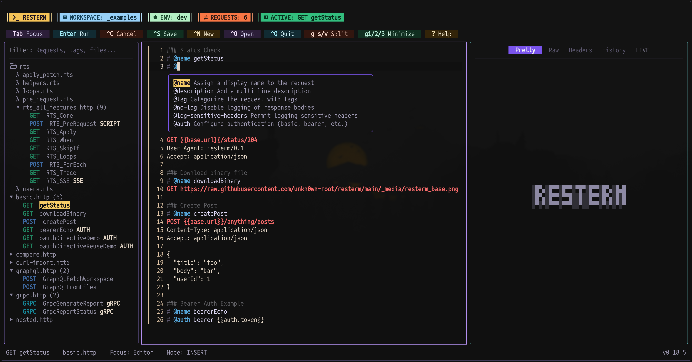
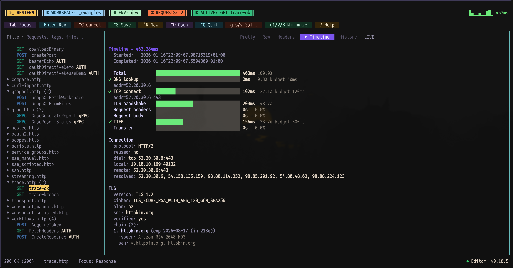
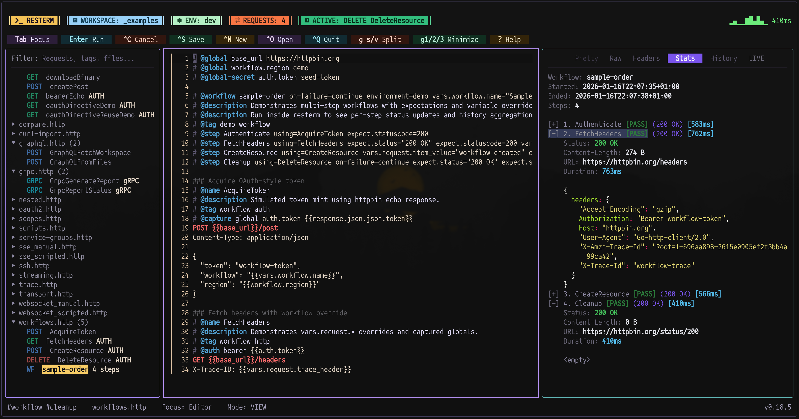
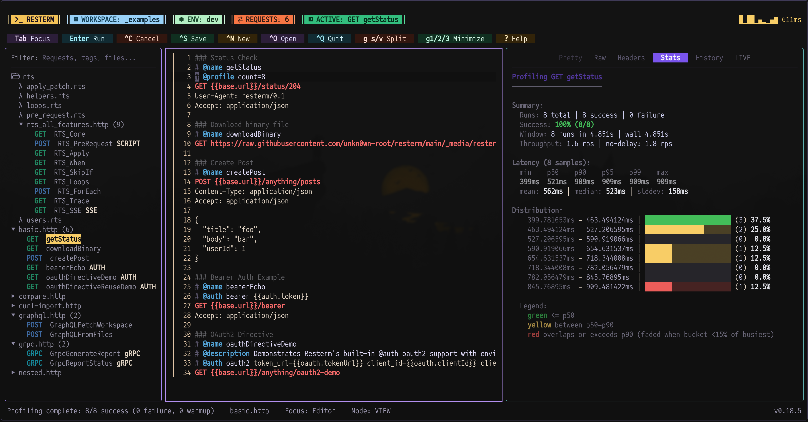

<h1 align="center">Resterm</h1>

<p align="center">
  <em>a terminal-based REST/GraphQL/gRPC/WebSocket/SSE client.</em>
</p>

<p align="center">
  
</p>

<p align="center">
  <strong>Trace and Timeline</strong>
</p>

<p align="center">
  
</p>

<p align="center">
  <strong>Workflows</strong>
</p>

<p align="center">
  
</p>

<p align="center">
  <strong>Profiler</strong>
</p>

<p align="center">
  
</p>

<p align="center">
  <strong>OAuth browser demo</strong>
</p>

<p align="center">
  
</p>

**Resterm** is a terminal client for working with **HTTP**, **GraphQL**, **gRPC**, **WebSocket** and **SSE**. No cloud sync, no signups, no heavy desktop app. If you live on the keyboard - this is your home.

TL;DR why resterm:
- Resterm is **keyboard driven**.
- Everything lives in plain files (.http/.rest) - **no cloud or account - everything stays local**.
- **Built-in SSH tunnels** for HTTP/gRPC/WebSocket/SSE.
- **OAuth 2.0 built-in** - client credentials, password grant, authorization code + PKCE with automatic browser flow and token refresh.
- **Scripting** to modify/assert requests, capture or reuse tokens and check or modify responses/streams.
- Fast iteration loop with _explorer_ + _history_ + _diff/compare_ + _captures/workflows_.
- **Debuggable** - timeline tracing, profiler, streaming transcripts and inline scripts/tests.

## Index
**Up & Running**
- [Features](#features)
- [Installation](#installation)
  - [Quick Install](#quick-install)
  - [Manual Installation](#manual-installation)
- [Update](#update)
- [Quick Start](#quick-start)
- [Quick Configuration Overview](#quick-configuration-overview)

---

**Deep dive**
- [OAuth 2.0](#feature-snapshots)
- [Workflows & scripting](#feature-snapshots)
- [Compare runs](#feature-snapshots)
- [Tracing & timeline](#feature-snapshots)
- [Streaming (WebSocket & SSE)](#feature-snapshots)
- [OpenAPI import](#feature-snapshots)
- [Theming & bindings](#feature-snapshots)
- [SSH Tunnels](#feature-snapshots)
- [Documentation](#documentation)

## Features
- **Workspace** navigator that filters `.http` / `.rest` files, supports recursion and keeps request lists in sync as you edit.
- **Editor** with inline syntax highlighting, search (`Ctrl+F`), clipboard motions, and inline metadata completions (type `@` for contextual hints).
- **Variables** with `@global` (environment-wide), `@var file` (document), `@var request` (per-call), plus compile-time constants (`@const`) and captures to stash secrets or derived values where you need them.
- **Scripting** via pre-request/test JavaScript hooks (ES5.1) to rewrite URLs/headers/bodies, seed tokens, and assert HTTP or streaming responses inline or via js files.
- **Workflows** compose several named requests (`@workflow` + `@step`) with shared `vars.workflow.*`, per step expectations and overrides.
- **GraphQL** helpers (`@graphql`, `@variables`, `@query`) and gRPC directives (`@grpc`, `@grpc-descriptor`, reflection, metadata).
- **WebSockets and SSE** with scripted `@ws` steps, automatic transcripts and an interactive console for ad-hoc frames.
- **OpenAPI importer** converts OpenAPI specs into Resterm-ready `.http` collections from the CLI.
- **Inline** requests and **curl** import for one-off calls (`Ctrl+Enter` on a URL or curl block).
- **Pretty/Raw/Header/Diff/History/Stream** views with optional split panes, pinned comparisons, and live event playback.
- **Binary responses** show size and type hints with hex and base64 previews, let you change Raw view modes, and include shortcuts to save with a path prompt (`g Shift+S`) or open externally (`g Shift+E`).
- **OAuth 2.0** with automatic token management - client credentials, password grant, and authorization code + PKCE. Tokens are cached per environment, refreshed automatically, and injected into requests without manual steps.
- **Latency** with `@profile` to benchmark endpoints and render histograms right inside the TUI.
- **Tracing and Timeline** with `@trace` to enable request tracing.
- **Multi-environment compare** via `@compare` directives or the global `--compare` flag.
- **SSH tunnels** route HTTP/gRPC/WebSocket/SSE traffic through bastions with host key verification, keep-alives, retries, and persistent tunnels.
- **File Watcher** with automatic file change detection: Resterm warns when the current file changes or goes missing on disk and lets you reload from disk (`g Shift+R`) or keep your buffer, plus a shortcut for quick workspace rescan (files) (`g Shift+O`).
- **Custom theming & bindings** if you want to make a resterm more alligned with your taste.

## Installation

### Quick Install

**Linux / macOS:**

**Homebrew:**

```bash
brew install resterm
```

> [!NOTE]
> Homebrew installs should be updated with Homebrew (`brew upgrade resterm`). The built-in `resterm --update` command is for binaries installed from GitHub releases/install scripts (not via brew).

**Shell script:**

> [!IMPORTANT]
> Pre-built Linux binaries depend on glibc **2.32 or newer**. If you run an older distro, build from source on a machine with a newer glibc toolchain or upgrade glibc before using the release archives.

```bash
curl -fsSL https://raw.githubusercontent.com/unkn0wn-root/resterm/main/install.sh | bash
```

or with `wget`:

```bash
wget -qO- https://raw.githubusercontent.com/unkn0wn-root/resterm/main/install.sh | bash
```

**Windows (PowerShell):**

```powershell
iwr -useb https://raw.githubusercontent.com/unkn0wn-root/resterm/main/install.ps1 | iex
```

These scripts will automatically detect your architecture, download the latest release, and install the binary.

### Manual Installation

> [!NOTE]
> The manual install helper uses `curl` and `jq`. Install `jq` with your package manager (`brew install jq`, `sudo apt install jq`, etc.).

#### Linux / macOS

```bash
# Detect latest tag
LATEST_TAG=$(curl -fsSL https://api.github.com/repos/unkn0wn-root/resterm/releases/latest | jq -r .tag_name)

# Download the matching binary (Darwin/Linux + amd64/arm64)
curl -fL -o resterm "https://github.com/unkn0wn-root/resterm/releases/download/${LATEST_TAG}/resterm_$(uname -s)_$(uname -m)"

# Make it executable and move it onto your PATH
chmod +x resterm
sudo install -m 0755 resterm /usr/local/bin/resterm
```

#### Windows (PowerShell)

```powershell
$latest = Invoke-RestMethod https://api.github.com/repos/unkn0wn-root/resterm/releases/latest
$asset  = $latest.assets | Where-Object { $_.name -like 'resterm_Windows_*' } | Select-Object -First 1
Invoke-WebRequest -Uri $asset.browser_download_url -OutFile resterm.exe
# Optionally relocate to a directory on PATH, e.g.:
Move-Item resterm.exe "$env:USERPROFILE\bin\resterm.exe"
```

#### From source

```bash
go install github.com/unkn0wn-root/resterm/cmd/resterm@latest
```

## Update

```bash
resterm --check-update
resterm --update
```

The first command reports whether a newer release is available; the second downloads and installs it (Windows users receive a staged binary to swap on restart).

## Quick Start

If you just want to hit an API **right now**, you don’t need any files.

1. **Start Resterm**

   ```bash
   # In a project directory (no files required)
   resterm

   # Or explicitly point to a workspace
   resterm --workspace path/to/project
   ```

2. **Type a minimal request**

   - Focus the editor pane (use `Tab` if needed).
   - Press `i` or `a` and type a simple request, for example:

     ```http
     GET https://httpbin.org/status/204
     ```

3. **Send it**

   - Press `Ctrl+Enter` to send the request.
   - The response appears in the response pane on the right.

4. **Move around**

   - `Tab` / `Shift+Tab` - cycle focus between sidebar, editor, and response.
   - `g+p` - jump directly to the response pane.
   - `g+i` - jump back to the editor.

That’s enough to be productive: open Resterm, type a URL, hit `Ctrl+Enter`, see the response.

---

### Quick Start (but with files)

If you work with **`.http` / `.rest` files**, Resterm will discover and use them.

1. **Open a directory with request files**

   - Create or open a directory that contains `.http` / `.rest` files
     (see `_examples/` in this repo for samples).
   - Run:

     ```bash
     resterm
     # or
     resterm --workspace path/to/project
     ```

2. **Pick and send a request**

   - Use the **sidebar** to select a request from your `.http` / `.rest` files.
   - Press `Ctrl+Enter` to send it.
   - The response shows up in the right pane.

3. **Minimal request file example**

   ```http
   ### Status check
   # @name status
   GET https://httpbin.org/status/204
   User-Agent: resterm

   ### Authenticated echo
   # @name bearerEcho
   # @auth bearer {{auth.token}}
   GET https://httpbin.org/bearer
   Accept: application/json
   ```

---

### Navigation & Layout Cheat Sheet

A few keys that make Resterm feel “native” quickly:

- **Pane focus & layout**
  - `Tab` / `Shift+Tab` - move focus between sidebar, editor, and response.
  - `g+r` - jump to **Requests** (sidebar).
  - `g+i` - jump to **Editor**.
  - `g+p` - jump to **Response**.
  - `g+h` / `g+l` - adjust layout:
    - When the **left pane** (sidebar) is focused: change sidebar width.
    - Otherwise: change editor/response split.
  - `g+v` / `g+s` - toggle response pane between inline and stacked layout.
  - `g+1`, `g+2`, `g+3` + minimize/restore sidebar, editor, response.
  - `g+z` / `g+Z` - zoom the focused pane / clear zoom.

- **Environments & globals**
  - `Ctrl+E` - switch environments.
  - `Ctrl+G` - inspect captured globals.

- **Working with responses**
  - `Ctrl+V` / `Ctrl+U` - split the response pane for side-by-side comparison.
  - When response pane is focused:
    - `Ctrl+Shift+C` or `g y` - copy the entire Pretty/Raw/Headers tab
      to the clipboard (no mouse selection needed).

---

> [!TIP]
> **If you only remember three shortcuts…**
> - `Ctrl+Enter` - send request
> - `Tab` / `Shift+Tab` - switch panes
> - `g+p` - jump to response


## Inline curl import

Drop a curl command into the editor and press `Ctrl+Enter` anywhere inside to turn it into a structured request. Resterm understands common flags (`-X`, `-H`, `--data*`, `--json`, `--url`, `--user`, `--compressed`, `-F/--form`, etc.), merges repeated data segments, and respects multipart uploads.

```bash
curl \
  --compressed \
  --url "https://httpbin.org/post?source=resterm&case=multipart" \
  --request POST \
  -H "Accept: application/json" \
  -H "X-Client: resterm-dev" \
  --user resterm:test123 \
  -F file=@README.md \
  --form-string memo='Testing resterm inline curl
with multiline value' \
  --form-string meta='{"env":"test","attempt":1}'
```

If you copied the command from a shell, prefixes like `sudo` or `$` are ignored automatically. Resterm loads the file attachment, preserves multiline form fields, and applies compression/auth headers without extra tweaks.

## Quick Configuration Overview

- **Environments:** JSON files (`resterm.env.json`) are auto-discovered in the request directory, workspace root, or CWD. Dotenv files (`.env`, `.env.*`) are opt-in via `--env-file` and are single-workspace; prefer JSON when you need multiple environments in one file.
- **Flags you probebly reach for most:** `--workspace`, `--file`, `--env`, `--env-file`, `--timeout`, `--insecure`, `--follow`, `--proxy`, `--recursive`, `--from-openapi`, `--http-out` (see docs for the full list).
- **Config storage:** `$HOME/Library/Application Support/resterm`, `%APPDATA%\resterm`, or `$HOME/.config/resterm` (override with `RESTERM_CONFIG_DIR`). Themes and keybindings live under this directory when you customize them.

## Feature snapshots

- **OAuth 2.0:** Full OAuth support with three grant types - client credentials for service-to-service calls, password grant for legacy systems, and authorization code + PKCE for user login flows. For auth code flows, Resterm opens your system browser, spins up a local callback server on `127.0.0.1`, captures the redirect and exchanges the code automatically. Tokens are cached per environment and refreshed when they expire. Docs: [`docs/resterm.md#oauth-20-directive`](./docs/resterm.md#oauth-20-directive) and `_examples/oauth2.http`.
- **SSH jumps/tunnels:** Route HTTP/gRPC/WebSocket/SSE through bastions with `@ssh` profiles (persist/keepalive/host-key/retries). Docs: [`docs/resterm.md#ssh-jumps`](./docs/resterm.md#ssh-tunnels) and `_examples/ssh.http`.
- **Scripting:** Pre-request/test JavaScript (Goja, ES5.1) to reshape URLs/headers/bodies, seed tokens, and assert HTTP or streaming responses (inline or via seeded .js files). Docs + sample: [`docs/resterm.md#scripting-api`](./docs/resterm.md#scripting-api) and `_examples/scripts.http`.
- **Workflows:** Chain requests with `@workflow`/`@step`, share `vars.workflow.*`, and attach per-step expectations or overrides. Docs + sample: [`docs/resterm.md#workflows-multi-step-workflows`](./docs/resterm.md#workflows-multi-step-workflows) and `_examples/workflows.http`.
- **Compare runs:** Run the same request across environments with `@compare` or `--compare`, then diff responses side by side (`g+c`). Docs: [`docs/resterm.md#compare-runs`](./docs/resterm.md#compare-runs).
- **Tracing & timeline:** Add `@trace` with budgets to capture DNS/connect/TLS/TTFB/transfer timings, visualize overruns, and optionally export spans to OpenTelemetry. Docs: [`docs/resterm.md#timeline--tracing`](./docs/resterm.md#timeline--tracing).
- **Streaming (WebSocket & SSE):** Use `@websocket` + `@ws` steps or `@sse` to script and record streams. The Stream tab keeps transcripts and an interactive console. Docs: [`docs/resterm.md#streaming-sse--websocket`](./docs/resterm.md#streaming-sse--websocket).
- **OpenAPI import:** Convert an OpenAPI 3 spec into `.http` collections from the CLI (`--from-openapi`). Docs: [`docs/resterm.md#importing-openapi-specs`](./docs/resterm.md#importing-openapi-specs).
- **Theming & bindings:** Optional customization via `themes/*.toml` and `bindings.toml/json` under the config dir; defaults are ready to use. Docs: [`docs/resterm.md#theming`](./docs/resterm.md#theming) and [`docs/resterm.md#custom-bindings`](./docs/resterm.md#custom-bindings).

## Documentation

The full reference, including request syntax, metadata, directive tables, scripting APIs, transport settings and advanced workflows, lives in [`docs/resterm.md`](./docs/resterm.md).
